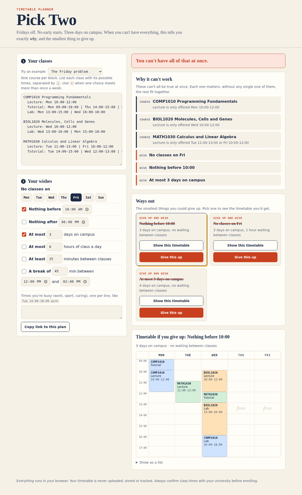
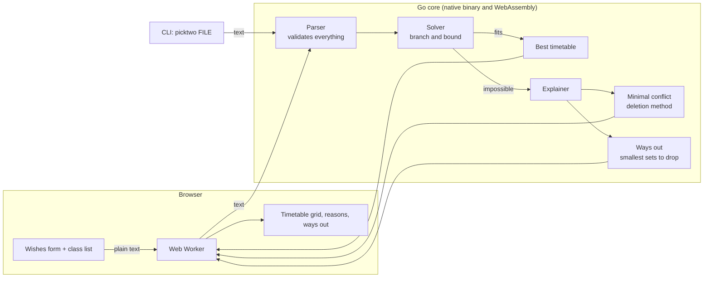

# Pick Two

**A timetable planner that tells you why you can't have everything, and the smallest thing to give up.**

[](https://github.com/reihooneh/pick-two/actions/workflows/ci.yml)


[](LICENSE)

**Live demo:** https://reihooneh.github.io/pick-two/



## Why I built this

Every semester starts the same way: a list of courses, a dozen possible class times, and a wish list. Fridays off. Nothing before 10. Only three days on campus.

Timetable generators already exist, and they are fine when everything fits. When it doesn't, they say "no valid timetable found" and leave you guessing which wish was the problem. So you untick things at random until something works, and never find out whether you gave up more than you had to.

Pick Two answers the two questions that actually matter:

1. **Why?** It shows the smallest set of courses and wishes that cannot all be true at once.
2. **What now?** It lists the smallest sacrifices that would fix it, each with the timetable you would get, so the trade-off is a choice instead of a guess.

The name is the old joke: fast, cheap, good, pick two. In the built-in example you want Fridays off, no early starts and three days on campus, and the planner proves you can have exactly two.

## Features

- **Finds the best timetable**, not just any: fewest days on campus first, then the least waiting between classes.
- **Explains impossibility** with a minimal conflict: every item listed is needed for the clash, and nothing else is blamed.
- **Offers ways out**: every single wish that could be dropped, then pairs, then triples, never suggesting more than necessary. If no wish can save it, it tells you which course to drop.
- **Eight kinds of wish**: days off, earliest start, latest finish, a lunch break, maximum days, maximum hours per day, minimum gap between classes, and busy times for work or anything else.
- **One click to accept a trade-off**: "Give this up" unticks the wish and re-plans.
- **Private by design**: runs entirely in your browser. Nothing is uploaded, stored or tracked.
- **Shareable**: a plan can be copied as a link that contains the whole thing.
- **Also a command-line tool** with exit codes, so the same engine can be scripted.
- Works on a phone, with a keyboard alone, and in dark mode.

## How it works

The planner is written in Go and compiled twice: to a native command-line program, and to WebAssembly for the browser. Both run exactly the same code.



- **Solver:** each class (lecture, lab, tutorial) is a variable and its possible times are the values. A depth-first search places one class at a time and abandons a branch the moment it breaks a rule. Once it has a timetable it keeps searching, but skips any branch that already uses as many days as the best one found.
- **Why it's impossible:** start with everything, which is known to fail. Remove one item; if it still fails, that item wasn't the problem, so leave it out. What survives is a set where every member matters.
- **Ways out:** try dropping each wish, then each pair, then each triple, skipping any combination that contains an answer already found.

[HOW-IT-WORKS.md](HOW-IT-WORKS.md) walks through all of it in plain language.

## The text format

The class list is plain text, so it's quick to type or paste:

```text
COMP1010 Programming Fundamentals
  Lecture: Mon 10:00-12:00 + Wed 10:00-11:00 | Tue 14:00-16:00 + Thu 14:00-15:00
  Tutorial: Mon 13:00-14:00 | Tue 09:00-10:00 | Fri 10:00-11:00

wish: no classes on Fri
wish: nothing before 10:00
```

- A line with a course code starts a course.
- `Name: time | time | time` lists a class and its alternatives. You attend one of them.
- `+` joins meetings that come together (a lecture stream that meets twice a week).
- Times can be `09:30`, `9`, or `2pm`.
- `#` starts a comment.

| Wish | Example line |
|---|---|
| Day off | `wish: no classes on Fri` |
| Earliest start | `wish: nothing before 10:00` |
| Latest finish | `wish: nothing after 18:00` |
| Lunch break | `wish: lunch 12:00-14:00 for 45 min` |
| Days on campus | `wish: at most 3 days` |
| Daily load | `wish: at most 6 hours per day` |
| Travel time | `wish: at least 15 min between classes` |
| Other commitments | `wish: busy Tue 14:00-18:00 work` |

In the web page the wishes are a form; you only type the classes.

## Command line

```text
$ picktwo examples/the-friday-problem.txt
No timetable can satisfy everything.

Why: these cannot all be true at once.
  - COMP1010 Programming Fundamentals
      Lecture is only offered Mon 10:00-12:00
  - BIOL1020 Molecules, Cells and Genes
      Lecture is only offered Wed 10:00-12:00
  - MATH1030 Calculus and Linear Algebra
      Lecture is only offered Tue 11:00-13:00 or Fri 10:00-12:00
  - No classes on Fri
  - Nothing before 10:00
  - At most 3 days on campus
  Each one matters: without any single one of them, the rest fit together.

Ways out (smallest sacrifices first):

  1. Give up: Nothing before 10:00
     Mon
       09:00-10:00  COMP1010   Tutorial
       10:00-12:00  COMP1010   Lecture
     Tue
       11:00-13:00  MATH1030   Lecture
     Wed
       10:00-12:00  BIOL1020   Lecture
       12:00-13:00  MATH1030   Tutorial
       13:00-16:00  BIOL1020   Lab
       16:00-18:00  COMP1010   Lab
     3 days on campus, no waiting between classes

  2. Give up: No classes on Fri
     ...
  3. Give up: At most 3 days on campus
     ...
```

`picktwo --json FILE` prints the same answer as JSON. Exit codes: `0` a timetable exists, `1` impossible as asked, `2` the input couldn't be read.

## Stack

| Part | Technology |
|---|---|
| Planner, parser, explainer, CLI | Go 1.24, standard library only |
| Browser engine | The same Go code compiled to WebAssembly |
| Page | Plain HTML, CSS and JavaScript modules. No framework, no bundler |
| Tests | Go's test and fuzz tools, Node's test runner, Playwright for the browser check |
| CI and hosting | GitHub Actions and GitHub Pages |

## Run it yourself

You need Go 1.24 or newer (and Node 20+ and Python 3 for the tests and local server).

```bash
git clone https://github.com/reihooneh/pick-two.git
cd pick-two

make build                                    # the command-line tool
./picktwo examples/the-friday-problem.txt

make serve                                    # the web page, at http://localhost:8080
```

## Tests

```bash
make lint    # gofmt and go vet, for native and WebAssembly builds
make test    # Go tests with the race detector, then the JavaScript tests
make fuzz    # 30 seconds of fuzzing through the whole pipeline
python3 scripts/browser-check.py   # end-to-end in headless Chromium (needs Playwright)
```

- **The solver is checked against brute force.** 3,000 random problems are solved twice: by the real solver and by a deliberately simple program that tries every combination. They must agree on whether a timetable exists and on the best one.
- **Explanations are checked by definition.** For hundreds of impossible problems: the reported conflict really is impossible, removing any one item makes it possible, every way out really works, and none gives up more than it needs to.
- **Fuzzing.** Arbitrary bytes go through the parser, solver and explainer; the program must never crash and never return a timetable with a clash. 640,000 runs locally with no failures, and 30 seconds more on every CI run.
- **Same answers in the browser.** A test loads the real WebAssembly build in Node and compares it with the native results.
- **End to end.** A headless browser drives the page at desktop and phone sizes: examples, "Give this up", error messages, share links, hostile links, keyboard use, and zero console errors under the security policy.

25 Go tests, 10 JavaScript tests and 7 browser scenarios at two screen sizes.

## Security

The short version: nothing leaves your browser, user text is never treated as HTML, every input and every loop is bounded, and there are no third-party dependencies.

- All page output uses `textContent`; a strict Content-Security-Policy backs that up.
- Share links are treated as hostile: validated, size-limited and rebuilt field by field.
- The solver has a fixed work budget and runs in a worker that can be stopped, so no input can freeze the page.
- Regular expressions run on Go's linear-time engine.
- The CLI rejects control characters, so a file can't inject terminal escape codes.

[SECURITY.md](SECURITY.md) has the full threat model, what tests cover each defence, and the known limits. No software can promise it is 100% secure; that file says plainly where the edges are.

## Honest limits

- You type the class times in. It doesn't fetch them from any university system, and it can't know about changes. Confirm before you enrol.
- "Best" means fewest days, then least waiting. Other tastes (compact mornings, long weekends) aren't modelled yet.
- Ways out are searched up to three wishes at a time. If you would need to drop four or more, it suggests dropping a course instead.
- On an extremely large timetable the search can hit its budget. It then says so, and never claims "impossible" without having checked everything.
- The WebAssembly file is about 3.5 MB (1 MB compressed), which is the cost of sharing one engine between the CLI and the browser.

## Roadmap

- [ ] Rank wishes by importance, so ways out prefer dropping the ones you care about least
- [ ] Import class times from an `.ics` calendar file
- [ ] Export the chosen timetable to `.ics`
- [ ] Show every alternative conflict, not just one
- [ ] Group planning: find a common free slot across several people's timetables

## License

[MIT](LICENSE)
